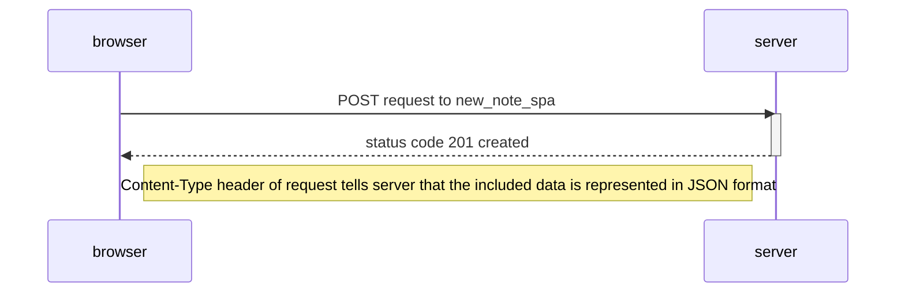

```mermaid
    sequenceDiagram
        participant browser
        participant server

        browser->>server: POST request to new_note_spa 
        activate server
        server-->>browser: status code 201 created
        deactivate server

        Note right of browser: Content-Type header of request tells server that the included data is represented in JSON format
```
